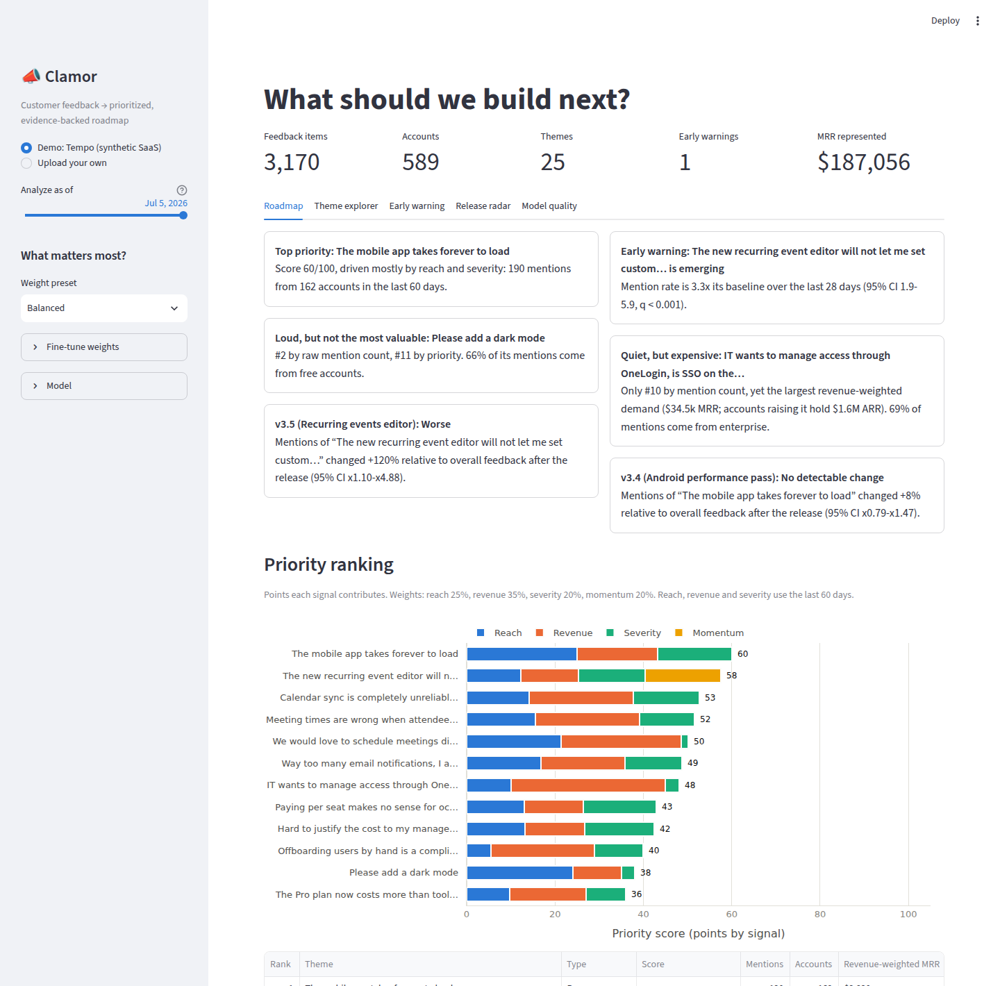
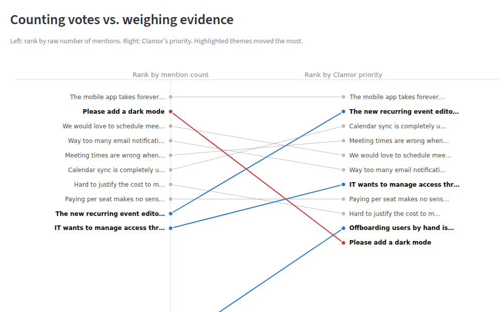
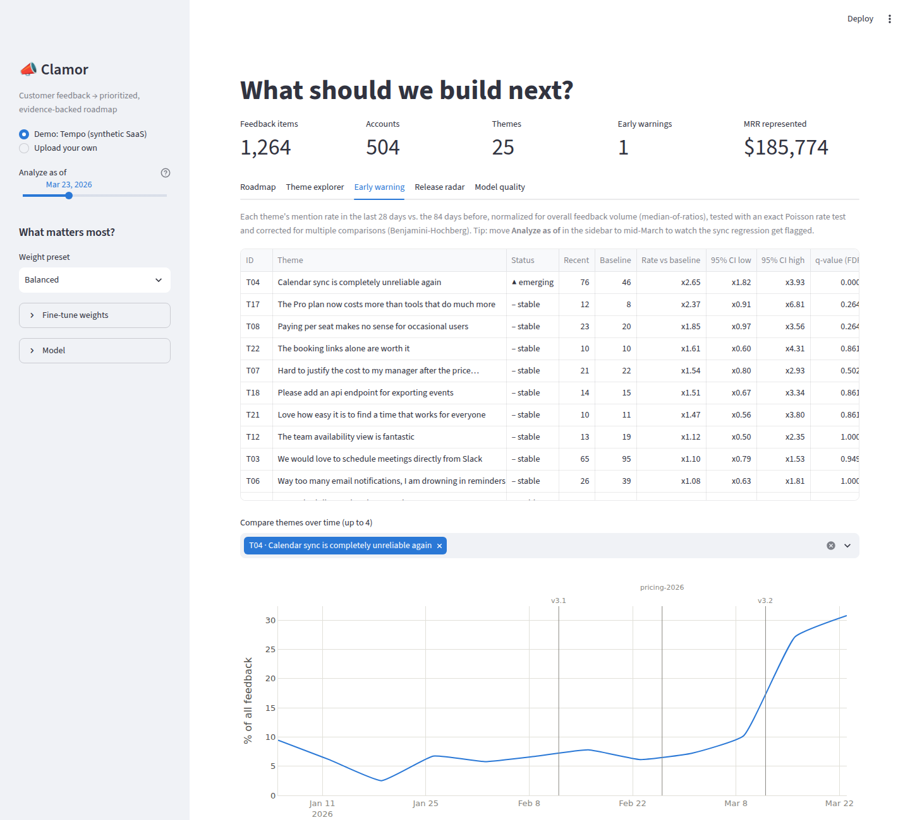
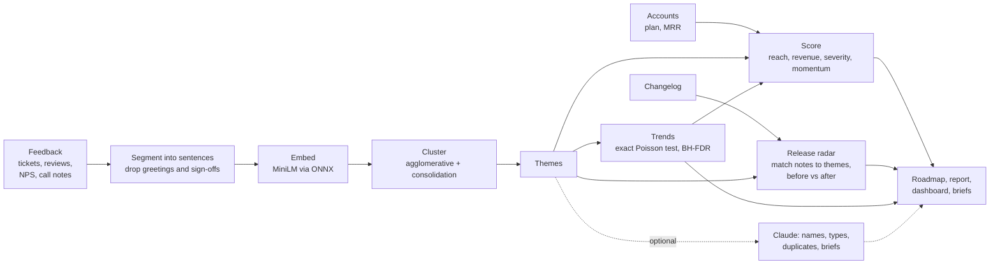
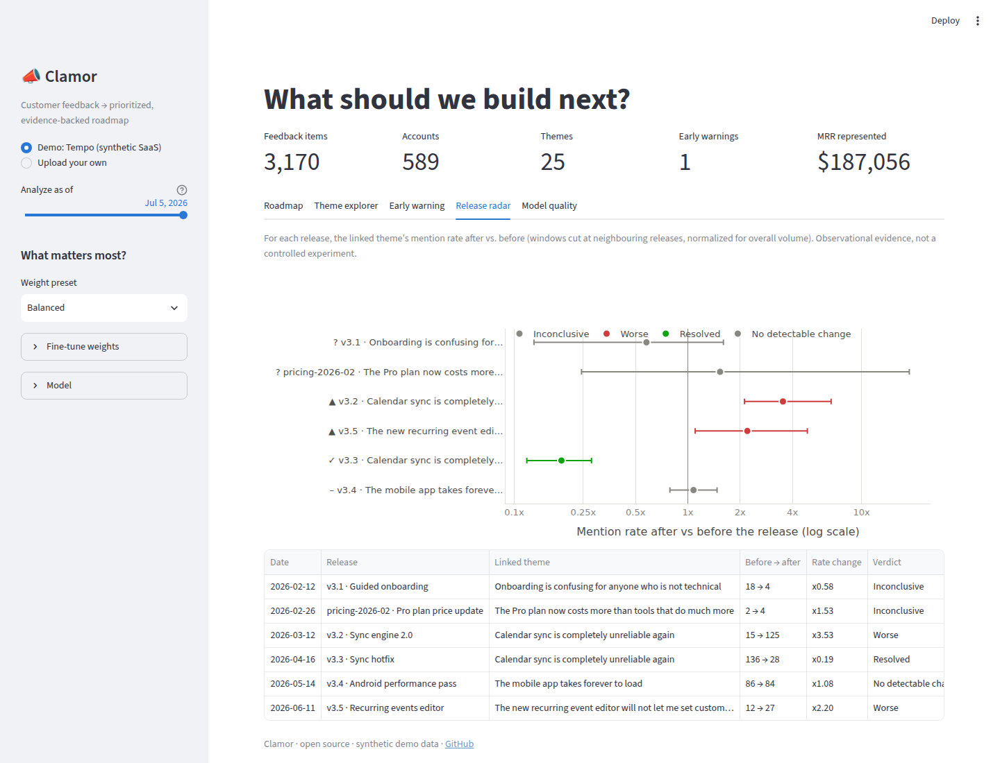
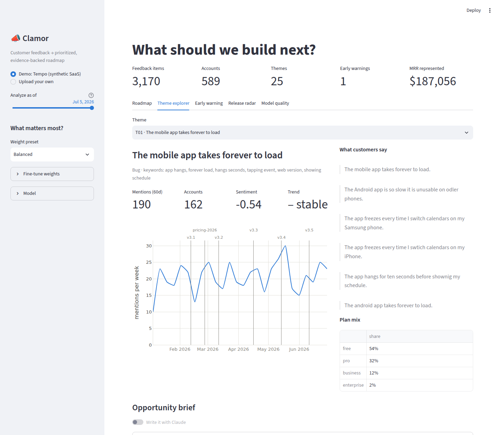

# 📣 Clamor

**Turn the noise of customer feedback into a prioritized, evidence-backed product roadmap.**

[](https://github.com/ArdaSeyhan34/clamor/actions/workflows/ci.yml)


Clamor reads thousands of support tickets, app-store reviews, NPS comments and sales-call
notes and answers the questions a product team actually has:

1. **What are customers talking about?** Themes are discovered automatically, with no
   labels or keyword lists to maintain.
2. **What should we build next?** Themes are ranked by *who* is asking and how much it
   hurts, not by how loud they are.
3. **What is breaking right now?** Themes growing faster than chance are flagged early,
   with statistics that keep false alarms down.
4. **Did what we shipped actually work?** Every release is checked against what
   customers said before and after it.

It works in **English and Turkish**, reads raw exports from the Google Play Console and
helpdesk tools as they are, and masks personal data (phone numbers, e-mails, card
numbers, IBANs, national IDs) before anything is analyzed. An optional **Claude** layer
names the themes the way a PM would and drafts a one-page opportunity brief for any of
them.



---

## Why counting votes is not enough

Most teams triage feedback by tagging tickets and counting. The simulated SaaS company in
the demo (a team-calendar app called *Tempo*) shows three ways that goes wrong. All
numbers below come from Clamor's own output on the demo data:

| Situation | What vote counting says | What Clamor says |
|---|---|---|
| **Loud but cheap:** dark mode | #2 most-mentioned request | #11 priority: 66% of mentions come from free accounts, revenue-weighted demand is only $3.4k MRR |
| **Quiet but expensive:** SSO / SAML | #10 by mentions (32) | Largest revenue-weighted demand ($34.5k MRR, 10x dark mode); the accounts asking hold $1.6M ARR. #1 under the *enterprise* weight preset |
| **A regression in progress:** recurring events editor (v3.5) | #9, easy to miss | #2 priority, flagged **emerging** 8 days after the release (rate 3.3x baseline, 95% CI 1.9-5.9, q < 0.001) |
| **A fix that worked:** sync hotfix (v3.3) | "tickets went down, I think?" | **Resolved**: mention rate x0.19 afterwards (95% CI 0.12-0.28) |
| **A fix that did nothing:** Android performance pass (v3.4) | "shipped, done" | **No detectable change** (x1.08, 95% CI 0.79-1.47), so the complaint is still #1 |

<p align="center"></p>

And with **time travel** you can see what Clamor would have said on any past day. On
March 23, eleven days after the v3.2 sync-engine rewrite, the sync complaints were
already flagged as emerging (2.65x their baseline):



## Does it actually work?

Unsupervised tools are easy to demo and hard to trust. The simulator keeps a ground-truth
table (the true topic of every item, when each incident really started, what each
release was meant to fix), so every stage is measured (`clamor evaluate`):

| What is measured | Result |
|---|---|
| Theme discovery: adjusted Rand index / NMI / homogeneity | **0.815 / 0.872 / 0.953** |
| Items that land in a theme about their true topic | **93%** |
| Releases linked to the theme they were meant to change | **6 / 6** |
| Sentiment sign accuracy | **87%** |
| Real incidents detected in a day-by-day replay | **3 / 3** (median 8 days after the start) |
| False alarm episodes over six months | **0** vs **34** for the common "this week is 2x the recent average" rule |

The naive rule is a few days faster, but it fires 34 separate false alarms. That trade-off
is deliberate: an alert channel that cries wolf gets muted.

**Ablation study:** each design decision was switched off one at a time
(`python scripts/ablation.py`):

| Variant | ARI | Homogeneity | Spikes caught | False alarms | Spurious trend flags |
|---|---:|---:|---:|---:|---:|
| **Clamor (default)** | **0.815** | **0.953** | **3/3** | **0** | **1** |
| Whole tickets instead of sentences | 0.415 | 0.637 | 2/3 | 3 | 22 |
| No boilerplate filter | 0.612 | 0.804 | 3/3 | 0 | 2 |
| No theme consolidation | 0.771 | 0.953 | 3/3 | 0 | 4 |
| Total-volume normalization (instead of median-of-ratios) | 0.815 | 0.953 | 3/3 | 0 | 12 |
| Lexical embeddings (TF-IDF) instead of MiniLM | 0.445 | 0.864 | 3/3 | 1 | 2 |

The single most important decision is to **cluster sentences, not tickets**: a support
ticket that opens with "Hi team, we've been customers for 2 years" and closes with
"Thanks, Maria" otherwise gets grouped by writing style instead of by problem. Details are
in [docs/methodology.md](docs/methodology.md).

## In Turkish, without revenue data

The second demo, **Lezzo**, is a fictional Turkish employee meal-card app: 2,738 app-store
reviews, support tickets and survey answers from end users, written the way people type on
a phone ("odeme gecmiyor", typos, capitals), with phone numbers and e-mail addresses inside
tickets and **no revenue data**, so the ranking rests on reach, severity and momentum
([report](reports/demo_lezzo/report.md)). The top five of its roadmap are five separate
bugs that the new QR payment screen (v5.3) introduced: payments that do not go through, a
white screen, a camera that does not read the code, payments that never reach the
restaurant and double charges, each flagged as *emerging* with its own evidence.

| What is measured | Result |
|---|---|
| Items that land in a theme about their true topic | **94%** (homogeneity 0.96) |
| Releases linked to the theme they were meant to change | **5 / 5** |
| Sentiment sign accuracy | **94%** |
| Real incidents detected in a day-by-day replay | **2 / 2** |
| False alarm episodes over six months | **5** vs **88** for the naive rule |
| Phone numbers and e-mails masked before analysis | **211 / 211** |

What changes for Turkish ([details](docs/methodology.md#12-turkish-and-consumer-apps)):
Turkish-aware case folding (`I` → `ı`, `İ` → `i`), matching that tolerates missing
diacritics, a sentiment lexicon matched on word stems for an agglutinative language, and a
multilingual MiniLM combined with TF-IDF, tuned to split distinct problems rather than
merge them.

## Quickstart

```bash
git clone https://github.com/ArdaSeyhan34/clamor.git && cd clamor
pip install -e ".[all]"          # Python 3.10+

clamor demo                      # analyze the demo data, evaluate it, write reports/demo/
clamor demo --scenario lezzo     # the Turkish demo (downloads a ~470 MB multilingual model)
streamlit run app/streamlit_app.py
```

The first run downloads the ~90 MB MiniLM model (ONNX, no PyTorch needed); analysis of
3,000 items then takes about 10 seconds on a laptop CPU. The generated report is committed
in [`reports/demo/report.md`](reports/demo/report.md), with example
[opportunity briefs](reports/demo/briefs/).

### Live demo in five minutes

- **Dashboard:** on [Streamlit Community Cloud](https://share.streamlit.io), create an
  app from this repository with main file `app/streamlit_app.py` (it installs
  `requirements.txt`). To enable Claude, add `ANTHROPIC_API_KEY` under *Secrets*.
- **Static report:** enable GitHub Pages with source *GitHub Actions*; the
  [Pages workflow](.github/workflows/pages.yml) publishes the demo report on every push
  to `main`.

### Use your own data

```bash
clamor analyze feedback.csv --accounts accounts.csv --releases releases.csv \
               --product-name "YourProduct" --preset balanced --out reports/mine

# several exports at once, in Turkish, without revenue data
clamor analyze play_reviews.csv tickets.csv --releases releases.csv --language tr
```

| File | Required columns | Optional columns |
|---|---|---|
| `feedback` (CSV, JSON, Excel) | `text`, `created_at` | `feedback_id`, `account_id`, `channel`, `rating` (stars or NPS) |
| `accounts` | `account_id`, `mrr` | `plan`, `seats`, `company` |
| `releases` | `date`, `title` | `version`, `description` |

Common export column names (`body`, `comment`, `review`, `timestamp`, `customer_id`, and
Turkish ones such as `Yorum`, `Açıklama`, `Tarih`, `Puan`) are recognized automatically,
as are UTF-16 Play Console files and semicolon-separated Excel exports. Without
`accounts`, ranking uses reach, severity and momentum only; without `releases`, the
release radar is skipped. The dashboard's *Upload your own* mode does the same without the
command line.

Working with real customer data? [docs/real-data.md](docs/real-data.md) covers exports,
keeping data out of git, privacy and a first-run checklist.

### Python API

```python
from clamor import analyze, PRESETS
from clamor.pipeline import rescore

result = analyze("feedback.csv", accounts="accounts.csv", releases="releases.csv")
result.roadmap[["name", "score", "mentions", "status"]].head()
rescore(result, PRESETS["enterprise"])  # re-rank instantly with other weights
result.releases[["version", "verdict", "rate_ratio"]]
```

## How it works



- **Segmentation:** items are split into sentences; call notes keep only the customer's
  quote; boilerplate ("please fix asap", "Thanks, Maria") is detected by semantic
  similarity to a small list of prototypes. One item can raise several themes.
- **Theme discovery:** [all-MiniLM-L6-v2](https://huggingface.co/sentence-transformers/all-MiniLM-L6-v2)
  embeddings, agglomerative clustering with a cosine-distance threshold (it handles
  themes of 500 and 30 mentions equally well, where k-means would not), then a
  consolidation pass that merges near-duplicate themes only when meaning **and**
  vocabulary agree.
- **Opportunity score:** reach (distinct accounts), **revenue-weighted demand** (each
  account's MRR split across everything it asked for, so one big customer cannot dominate
  every theme), severity (negative-sentiment share) and momentum (a *significant* recent
  lift). Every score is decomposed into its parts, so anyone can see why a theme ranks
  where it does.
- **Early warning:** a theme's mention rate over the last 28 days is compared with the 84
  days before, using an exact conditional Poisson test, median-of-ratios volume
  normalization (borrowed from RNA-seq analysis) and Benjamini-Hochberg FDR control.
- **Release radar:** release notes are embedded with the same model, matched to the
  closest theme and tested before vs after, with windows cut at neighbouring releases.
  Verdicts: *Resolved, Improved, No detectable change, Worse, Inconclusive*. Themes that
  spike after a release they were not linked to are reported as suspected side effects.

<p align="center"></p>

## Claude integration

Set `ANTHROPIC_API_KEY` (or a Streamlit secret) and install the `llm` extra to enable:

- **Theme review:** Claude receives each theme's keywords, statistics and 8
  representative quotes (never the full corpus) and returns a roadmap-style name, a type,
  a one-line summary and duplicate suggestions, using a JSON schema (structured outputs).
  Duplicates are merged and the analysis is recomputed.
- **Opportunity briefs:** a one-page brief (problem, who is affected, evidence, why now,
  options, success metrics, open questions) written strictly from an evidence pack of
  numbers and quotes.

Everything works without a key: themes are then named after their most representative
customer quote, and briefs come from a deterministic template
([example](reports/demo/briefs/02-T11.md)). Any API failure falls back the same way, and
the tests use a fake client, so CI never needs a key.



## Project structure

```
clamor/
  synth.py        simulator for the English demo company, with ground truth
  synth_lezzo.py  simulator for the Turkish consumer-app demo
  lang.py         language packs: boilerplate, stop words, sentiment lexicon, cues
  privacy.py      masking of phone numbers, e-mails, cards, IBANs, national IDs
  io.py           loaders for raw exports (encodings, delimiters, column names)
  text.py         sentence segmentation and boilerplate detection
  embeddings.py   MiniLM and multilingual MiniLM (ONNX), TF-IDF and hybrid backends
  themes.py       clustering, consolidation, keywords, theme types
  sentiment.py    lexicon sentiment, blended with star/NPS ratings
  stats.py        exact rate test, median-of-ratios, Benjamini-Hochberg
  trends.py       early-warning statuses
  impact.py       release radar
  scoring.py      opportunity score and its decomposition
  pipeline.py     build_theme_model (slow part) + analyze (fast, re-runnable)
  evaluate.py     accuracy metrics and day-by-day alert backtest
  llm.py          Claude theme review and briefs
  briefs.py       evidence packs and template briefs
  report.py       Markdown and HTML reports
  cli.py          `clamor` command
app/streamlit_app.py   interactive dashboard
scripts/ablation.py    ablation study
scripts/tune.py        threshold grid search per backend and scenario
tests/                 59 tests, run offline
docs/                  methodology, a PM case study, a guide for real data
```

## Documentation

- [Methodology](docs/methodology.md): every modeling and statistical choice, with the
  experiments behind it.
- [Case study](docs/case-study.md): the demo data read the way a product manager would,
  ending in a quarter's recommendations.
- [Running on real data](docs/real-data.md): exports, privacy and a first-run checklist.

## Limitations and next steps

- **Synthetic benchmark.** The accuracy numbers come from a simulator. It is deliberately
  messy (typos, mixed topics, templates, uneven volumes), but real feedback is messier.
  Next step: a small hand-labeled sample of public app reviews.
- **Gradual shifts are detected late.** The pricing complaints after the price change
  rose gradually and were split across three sub-themes; Clamor flagged them after 54
  days. A dedicated change-point method would help here.
- **Observational, not causal.** The release radar compares before and after; anything
  else that changed at the same time is not controlled for. Feature flags plus a holdout
  group would turn verdicts into estimates.
- **Themes are learned on the full history.** Time travel replays the statistics, not the
  clustering, so the backtest is slightly optimistic. An online variant would assign new
  items to existing themes and open new themes when nothing fits.
- **Two languages.** English and Turkish have language packs (boilerplate, stop words,
  sentiment lexicon, cue phrases); another language needs a pack of its own in
  `clamor/lang.py` and a threshold search with `scripts/tune.py`.

## License

[MIT](LICENSE)
